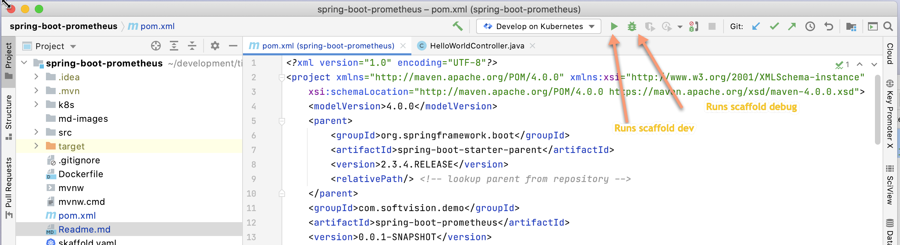

# Read Me First

# Getting Started

Requires
1) docker desktop
2) kubectl      
   brew install kubectl-cli  
3) KinD or k3d. We are using KinD here    
   brew install kind

## Kind setup
Mac os
```
brew install kind
```
Now create a single node cluster named **dev**

```
kind create cluster --name dev
```
Optional create a multi node cluster
```bash
kind create cluster --name dev --config ./1cp-3workers.yaml
```
1cp-3workers.yaml
```yaml  
kind: Cluster
apiVersion: kind.x-k8s.io/v1alpha4
nodes:
  - role: control-plane
  - role: worker
  - role: worker
  - role: worker
```
```bash
kubectl get nodes

~ » kubectl get nodes                                                                 chesterpressler@SVUSLP00196
NAME                STATUS   ROLES    AGE     VERSION
dev-control-plane   Ready    master   3m15s   v1.19.1
dev-worker          Ready    <none>   2m46s   v1.19.1
dev-worker2         Ready    <none>   2m46s   v1.19.1
dev-worker3         Ready    <none>   2m46s   v1.19.1
```


## Building App


```bash
mvn clean compile
# to build via Jib
mvn jib:build

# to build a docker build
mvn jib:dockerBuild
```

## Running app

### Running via command line
```bash
skaffold dev --port-forward  

skaffold debug --port-forward 
```
*optional: You can create a separate NameSpace in the cluster to deploy to*
```bash
kubectl create ns test
skaffold dev --port-forward <-n test> 

skaffold debug --port-forward <-n test> 
```
If you have issues you can also add *-v debug* to your command to show more information about possible errors
or other failures.
```bash
skaffold dev -v debug --port-forward 
```
#### Port Forwarding
Port forwarding has changed recently for dev mode. In dev mode it only forward the Service Type ports. You need to specify the POD forwarding in the **skaffold.yaml** file
The additional yaml below will forward the deployment resource to the host machine so its available at http://localhost:8080/hello-world
```yaml
portForward:
  - resourceType: deployment
    resourceName: demo # must match k8 deployment app name
    port: 8080
    localPort: 8080
```
Info is here. https://github.com/GoogleContainerTools/skaffold/issues/2408
### Running via IntelliJ



## Showing the Spring Boot Application Metrics.

1) make sure you have the proper dependencies
```xml
		<dependency>
			<groupId>org.springframework.boot</groupId>
			<artifactId>spring-boot-starter-actuator</artifactId>
		</dependency>
		<dependency>
			<groupId>io.micrometer</groupId>
			<artifactId>micrometer-registry-prometheus</artifactId>
		</dependency>
```
2) make sure you enable the proper endpoints to scrape. The endpoint can also be 
secured by a login and password also. This is configured in the application.yaml file.    
```yaml
management:
   endpoints:
      web:
         exposure:
            include: 'metrics, health, beans, env, info , prometheus, loggers, configprops'
   endpoint:
      health:
         show-details: always
      prometheus:
         enabled: true
      beans:
         enabled: true
      loggers:
         enabled: true
   metrics:
      tags:
         application: ${spring.application.name} # used by the grafana dashboard springboot 2.1   
   
   
```
Once those changes are made,  you should be able to see the metric endpoints at the following location.
http://localhost:8080/actuator

## Issues
Issue: Control C not working in terminal. This occurs if you are using the terminal window and trying to stop a running skaffold process.       
Fix: Change the IntelliJ runtine to the embedded version of JDK and not an external one   

Issue: README.md is not showing preview mode in right pane      
Fix: Change the IntelliJ runtine to the embedded version of JDK and not an external one. Follow the instructions here. https://github.com/denis-fokin/ChooseRuntime/blob/master/README.md